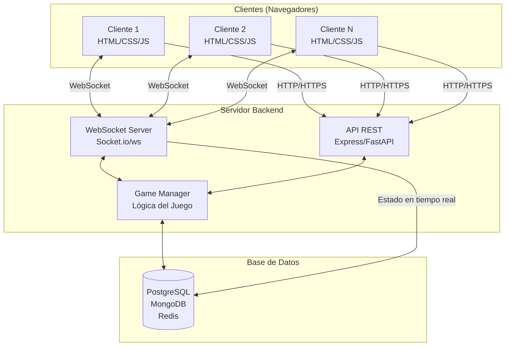
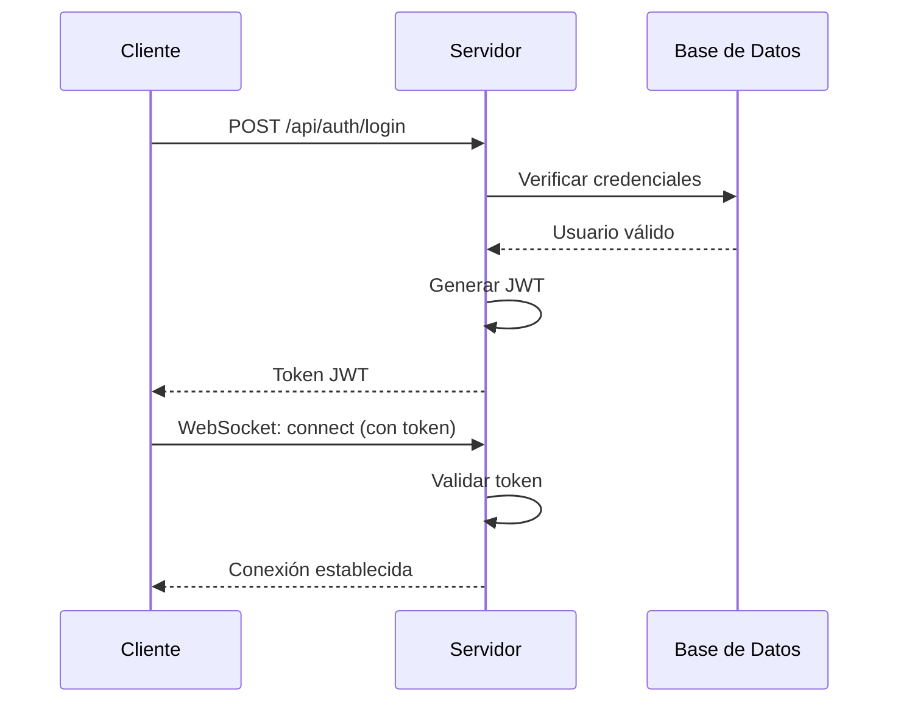
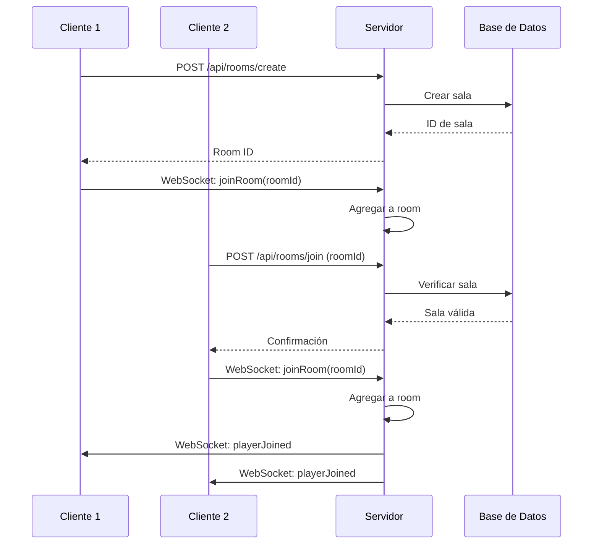
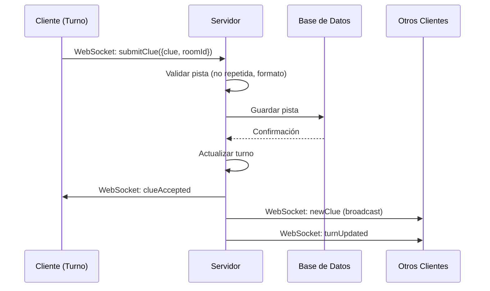
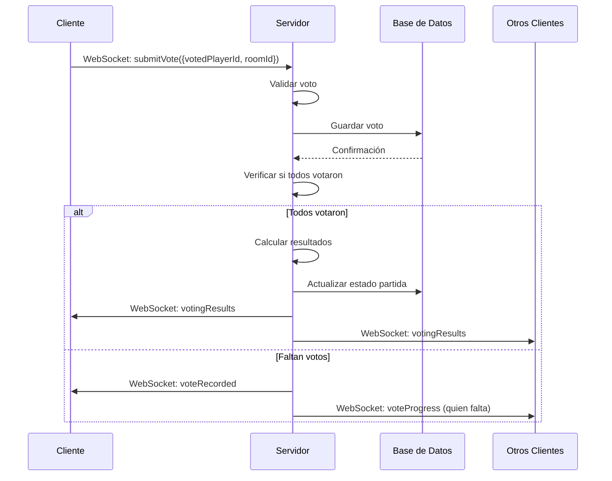

# 🚀 Tecnologías Open Source para Juego Impostor Multijugador Online

Este documento detalla todas las tecnologías open source **completamente gratuitas** necesarias para convertir el juego Impostor en una experiencia multijugador online.

---

## 📐 Arquitectura General

### Diagrama de Flujo Cliente-Servidor



### Explicación de la Comunicación en Tiempo Real

El juego requiere comunicación bidireccional en tiempo real entre múltiples clientes y el servidor:

1. **WebSockets**: Conexión persistente que permite:
   - Notificaciones instantáneas cuando un jugador envía una pista
   - Sincronización del estado del juego para todos los jugadores
   - Actualizaciones de votación en tiempo real
   - Gestión de turnos automática

2. **API REST**: Para operaciones que no requieren tiempo real:
   - Autenticación de usuarios
   - Creación de salas de juego
   - Consulta de estadísticas
   - Gestión de perfiles

3. **Base de Datos**: Almacena:
   - Estado persistente de las partidas
   - Información de usuarios
   - Historial de juegos
   - Configuraciones de salas

---

## 🛠️ Stack Tecnológico Recomendado

### Opción 1: Stack JavaScript (Recomendado para principiantes)

**Ventajas**: Mismo lenguaje en frontend y backend, ecosistema maduro, fácil de aprender.

- **Backend**: Node.js + Express.js
- **WebSockets**: Socket.io
- **Base de Datos**: PostgreSQL (con Sequelize) o MongoDB (con Mongoose)
- **Autenticación**: JWT (jsonwebtoken) + bcrypt
- **Frontend**: HTML/CSS/JavaScript (sin cambios)

### Opción 2: Stack Python

**Ventajas**: Sintaxis clara, excelente para lógica de juego, gran comunidad.

- **Backend**: Python + FastAPI o Flask
- **WebSockets**: FastAPI WebSockets o Flask-SocketIO
- **Base de Datos**: PostgreSQL (con SQLAlchemy) o MongoDB (con Motor)
- **Autenticación**: JWT (PyJWT) + passlib
- **Frontend**: HTML/CSS/JavaScript (sin cambios)

### Opción 3: Stack Minimalista (Solo WebSockets)

**Ventajas**: Más simple, menos dependencias, ideal para prototipos.

- **Backend**: Node.js + ws (librería WebSocket nativa)
- **Base de Datos**: Redis (solo para estado temporal) o JSON files
- **Autenticación**: Tokens simples
- **Frontend**: HTML/CSS/JavaScript (sin cambios)

---

## 📦 Opciones de Tecnologías por Categoría

### Backend

#### Node.js + Express.js ⭐ (Recomendado)

**Descripción**: Runtime de JavaScript en el servidor con framework web minimalista.

**Instalación**:
```bash
npm init -y
npm install express socket.io
```

**Ventajas**:
- Mismo lenguaje que el frontend
- Gran ecosistema de paquetes (npm)
- Fácil integración con Socket.io
- Documentación extensa

**Desventajas**:
- Single-threaded (puede ser limitante para juegos muy complejos)

**Licencia**: MIT (Open Source)

#### Python + FastAPI

**Descripción**: Framework moderno de Python para APIs rápidas con soporte nativo de WebSockets.

**Instalación**:
```bash
pip install fastapi uvicorn websockets
```

**Ventajas**:
- Muy rápido y eficiente
- Soporte nativo de WebSockets
- Documentación automática (Swagger)
- Type hints integrados

**Desventajas**:
- Requiere conocimiento de Python
- Menos común para juegos web

**Licencia**: MIT (Open Source)

#### Python + Flask + Flask-SocketIO

**Descripción**: Framework web minimalista de Python con extensión para WebSockets.

**Instalación**:
```bash
pip install flask flask-socketio
```

**Ventajas**:
- Muy simple y fácil de aprender
- Gran flexibilidad
- Comunidad grande

**Desventajas**:
- Menos performante que FastAPI
- Configuración manual de WebSockets

**Licencia**: BSD (Open Source)

### Base de Datos

#### PostgreSQL ⭐ (Recomendado para datos relacionales)

**Descripción**: Base de datos relacional open source robusta y escalable.

**Características**:
- ACID compliant
- Soporte para JSON
- Muy estable y confiable
- Gratis y open source

**Uso en el juego**:
- Almacenar usuarios y perfiles
- Guardar historial de partidas
- Relaciones entre jugadores y partidas

**Licencia**: PostgreSQL License (Open Source)

**Hosting Gratuito**:
- Supabase (500MB gratis)
- ElephantSQL (20MB gratis)
- Railway (gratis con límites)

#### MongoDB ⭐ (Recomendado para datos flexibles)

**Descripción**: Base de datos NoSQL orientada a documentos.

**Características**:
- Esquema flexible
- Ideal para datos JSON
- Fácil de usar con JavaScript
- Escalable horizontalmente

**Uso en el juego**:
- Almacenar estado de partidas como documentos
- Guardar pistas y votos como arrays
- Perfiles de usuarios flexibles

**Licencia**: Server Side Public License (SSPL) - Open Source

**Hosting Gratuito**:
- MongoDB Atlas (512MB gratis)
- Railway (gratis con límites)

#### Redis (Para estado temporal)

**Descripción**: Base de datos en memoria para datos temporales y caché.

**Características**:
- Extremadamente rápido
- Ideal para sesiones y estado temporal
- Soporte para pub/sub (útil para WebSockets)

**Uso en el juego**:
- Estado activo de partidas en curso
- Gestión de salas de juego
- Caché de datos frecuentes

**Licencia**: BSD (Open Source)

**Hosting Gratuito**:
- Upstash (10,000 comandos/día gratis)
- Redis Cloud (30MB gratis)

### WebSockets

#### Socket.io ⭐ (Recomendado)

**Descripción**: Librería que proporciona comunicación bidireccional en tiempo real.

**Instalación**:
```bash
# Backend
npm install socket.io

# Frontend (incluir en HTML)
<script src="/socket.io/socket.io.js"></script>
```

**Ventajas**:
- Fallback automático a polling si WebSockets fallan
- Rooms y namespaces para organizar conexiones
- Reconexión automática
- Muy fácil de usar
- Compatible con Express.js

**Ejemplo básico**:
```javascript
// Servidor
const io = require('socket.io')(server);
io.on('connection', (socket) => {
  socket.on('clue-submitted', (data) => {
    io.to(data.roomId).emit('clue-received', data);
  });
});

// Cliente
const socket = io();
socket.emit('clue-submitted', { clue: 'palabra', roomId: 'room1' });
socket.on('clue-received', (data) => {
  console.log('Nueva pista:', data);
});
```

**Licencia**: MIT (Open Source)

#### ws (WebSocket nativo)

**Descripción**: Implementación pura de WebSockets para Node.js.

**Instalación**:
```bash
npm install ws
```

**Ventajas**:
- Muy ligero y rápido
- Sin dependencias adicionales
- Control total sobre la conexión

**Desventajas**:
- Más código manual necesario
- No tiene fallback automático
- Menos features out-of-the-box

**Licencia**: MIT (Open Source)

#### uWebSockets.js

**Descripción**: Implementación ultra-rápida de WebSockets escrita en C++.

**Instalación**:
```bash
npm install uWebSockets.js
```

**Ventajas**:
- Extremadamente rápido
- Muy eficiente con memoria
- Ideal para muchos usuarios simultáneos

**Desventajas**:
- API más compleja
- Requiere más conocimiento técnico

**Licencia**: Apache 2.0 (Open Source)

### Autenticación

#### JWT (JSON Web Tokens) ⭐

**Descripción**: Estándar para tokens de autenticación sin estado.

**Instalación**:
```bash
# Node.js
npm install jsonwebtoken

# Python
pip install PyJWT
```

**Ventajas**:
- Sin necesidad de sesiones en servidor
- Escalable
- Funciona bien con APIs REST
- Estándar de la industria

**Uso**:
- Generar token al iniciar sesión
- Incluir token en cada petición
- Validar token en el servidor

**Licencia**: MIT (Open Source)

#### Passport.js (Node.js)

**Descripción**: Middleware de autenticación flexible para Node.js.

**Instalación**:
```bash
npm install passport passport-local passport-jwt
```

**Ventajas**:
- Múltiples estrategias (local, JWT, OAuth, etc.)
- Muy flexible
- Gran comunidad

**Licencia**: MIT (Open Source)

#### bcrypt (Node.js) / passlib (Python)

**Descripción**: Librerías para hashear contraseñas de forma segura.

**Instalación**:
```bash
# Node.js
npm install bcrypt

# Python
pip install passlib[bcrypt]
```

**Licencia**: MIT / BSD (Open Source)

---

## 🌐 Hosting Gratuito

### Backend

#### Railway ⭐ (Recomendado)

**Características**:
- $5 de crédito gratis mensual (suficiente para desarrollo)
- Deploy automático desde GitHub
- Soporte para Node.js, Python, PostgreSQL, MongoDB, Redis
- SSL automático
- Muy fácil de usar

**URL**: https://railway.app

#### Render

**Características**:
- Plan gratuito disponible
- Deploy automático desde GitHub
- Soporte para múltiples lenguajes
- SSL automático
- Puede "dormir" después de inactividad (gratis)

**URL**: https://render.com

#### Fly.io

**Características**:
- Plan gratuito generoso
- Deploy global (múltiples regiones)
- Muy rápido
- Ideal para aplicaciones con baja latencia

**URL**: https://fly.io

#### Heroku (Alternativa)

**Características**:
- Plan gratuito limitado (Eco Dyno)
- Fácil de usar
- Gran documentación
- Nota: El plan gratuito tiene limitaciones

**URL**: https://www.heroku.com

### Frontend

#### Vercel ⭐ (Recomendado)

**Características**:
- Completamente gratis
- Deploy automático desde GitHub
- CDN global
- SSL automático
- Perfecto para sitios estáticos

**URL**: https://vercel.com

#### Netlify

**Características**:
- Plan gratuito generoso
- Deploy automático
- CDN global
- SSL automático
- Funciones serverless incluidas

**URL**: https://www.netlify.com

#### GitHub Pages

**Características**:
- Completamente gratis
- Integrado con GitHub
- SSL automático
- Ideal para proyectos open source

**URL**: https://pages.github.com

### Base de Datos en la Nube

#### Supabase (PostgreSQL) ⭐

**Características**:
- 500MB de base de datos gratis
- API REST automática
- Autenticación incluida
- Real-time subscriptions
- Muy fácil de usar

**URL**: https://supabase.com

#### MongoDB Atlas

**Características**:
- 512MB de almacenamiento gratis
- Cluster compartido gratuito
- Muy fácil de configurar
- Dashboard intuitivo

**URL**: https://www.mongodb.com/cloud/atlas

#### ElephantSQL (PostgreSQL)

**Características**:
- 20MB gratis (suficiente para desarrollo)
- PostgreSQL completo
- Muy simple

**URL**: https://www.elephantsql.com

#### Upstash (Redis)

**Características**:
- 10,000 comandos por día gratis
- Serverless Redis
- Perfecto para estado temporal

**URL**: https://upstash.com

---

## 🏗️ Implementación Paso a Paso

### Estructura de Carpetas Sugerida

```
impostor-multijugador/
├── frontend/                 # Código del cliente
│   ├── index.html
│   ├── styles.css
│   ├── game.js              # Lógica del juego (modificada)
│   ├── socket-client.js     # Nueva: Manejo de WebSockets
│   └── words.js
│
├── backend/                  # Código del servidor
│   ├── server.js            # Servidor principal
│   ├── routes/              # Rutas API REST
│   │   ├── auth.js
│   │   └── rooms.js
│   ├── sockets/             # Handlers de WebSockets
│   │   └── gameSocket.js
│   ├── models/              # Modelos de base de datos
│   │   ├── User.js
│   │   ├── Room.js
│   │   └── Game.js
│   ├── middleware/          # Middleware (auth, validación)
│   │   └── auth.js
│   └── utils/               # Utilidades
│       └── gameLogic.js
│
├── package.json
└── README.md
```

### Flujo de Datos

#### 1. Conexión Inicial



#### 2. Crear/Unirse a Sala



#### 3. Envío de Pista



#### 4. Votación



### Ejemplo de Código Básico

#### Backend (Node.js + Express + Socket.io)

```javascript
// server.js
const express = require('express');
const http = require('http');
const socketIo = require('socket.io');
const cors = require('cors');

const app = express();
const server = http.createServer(app);
const io = socketIo(server, {
  cors: {
    origin: "*",
    methods: ["GET", "POST"]
  }
});

app.use(cors());
app.use(express.json());

// Almacenamiento temporal de salas (en producción usar Redis/DB)
const rooms = new Map();

// WebSocket connection
io.on('connection', (socket) => {
  console.log('Usuario conectado:', socket.id);

  // Unirse a una sala
  socket.on('joinRoom', (roomId) => {
    socket.join(roomId);
    
    if (!rooms.has(roomId)) {
      rooms.set(roomId, {
        players: [],
        clues: [],
        votes: {},
        currentTurn: 0,
        secretWord: ''
      });
    }
    
    const room = rooms.get(roomId);
    io.to(roomId).emit('roomState', room);
  });

  // Enviar pista
  socket.on('submitClue', (data) => {
    const { roomId, clue, playerId } = data;
    const room = rooms.get(roomId);
    
    if (!room) return;
    
    // Validar pista
    const isDuplicate = room.clues.some(c => 
      c.clue.toLowerCase() === clue.toLowerCase()
    );
    
    if (isDuplicate) {
      socket.emit('clueError', { message: 'Pista duplicada' });
      return;
    }
    
    // Agregar pista
    room.clues.push({ playerId, clue });
    room.currentTurn++;
    
    // Broadcast a todos en la sala
    io.to(roomId).emit('newClue', { playerId, clue });
    io.to(roomId).emit('roomState', room);
  });

  // Enviar voto
  socket.on('submitVote', (data) => {
    const { roomId, voterId, votedPlayerId } = data;
    const room = rooms.get(roomId);
    
    if (!room) return;
    
    room.votes[voterId] = votedPlayerId;
    
    // Verificar si todos votaron
    const allPlayers = room.players.length;
    const votesCount = Object.keys(room.votes).length;
    
    if (votesCount >= allPlayers) {
      // Calcular resultados
      const results = calculateVotingResults(room);
      io.to(roomId).emit('votingResults', results);
    } else {
      io.to(roomId).emit('voteProgress', { 
        votesCount, 
        totalPlayers: allPlayers 
      });
    }
  });

  socket.on('disconnect', () => {
    console.log('Usuario desconectado:', socket.id);
  });
});

function calculateVotingResults(room) {
  const voteCounts = {};
  Object.values(room.votes).forEach(votedId => {
    voteCounts[votedId] = (voteCounts[votedId] || 0) + 1;
  });
  
  let maxVotes = 0;
  let mostVotedId = null;
  
  Object.entries(voteCounts).forEach(([playerId, count]) => {
    if (count > maxVotes) {
      maxVotes = count;
      mostVotedId = parseInt(playerId);
    }
  });
  
  return { mostVotedId, voteCounts };
}

const PORT = process.env.PORT || 3000;
server.listen(PORT, () => {
  console.log(`Servidor corriendo en puerto ${PORT}`);
});
```

#### Frontend (socket-client.js - Nuevo archivo)

```javascript
// socket-client.js
class GameSocket {
  constructor() {
    this.socket = null;
    this.roomId = null;
  }

  connect(serverUrl) {
    this.socket = io(serverUrl);
    
    this.socket.on('connect', () => {
      console.log('Conectado al servidor');
    });

    this.socket.on('roomState', (state) => {
      this.updateGameState(state);
    });

    this.socket.on('newClue', (data) => {
      this.displayNewClue(data);
    });

    this.socket.on('votingResults', (results) => {
      this.showVotingResults(results);
    });

    this.socket.on('clueError', (error) => {
      alert(error.message);
    });
  }

  joinRoom(roomId) {
    this.roomId = roomId;
    this.socket.emit('joinRoom', roomId);
  }

  submitClue(clue, playerId) {
    this.socket.emit('submitClue', {
      roomId: this.roomId,
      clue: clue,
      playerId: playerId
    });
  }

  submitVote(voterId, votedPlayerId) {
    this.socket.emit('submitVote', {
      roomId: this.roomId,
      voterId: voterId,
      votedPlayerId: votedPlayerId
    });
  }

  updateGameState(state) {
    // Actualizar UI con el estado del juego
    gameState = state;
    updateUI();
  }

  displayNewClue(data) {
    // Mostrar nueva pista en la UI
    addClueToDisplay(data);
  }

  showVotingResults(results) {
    // Mostrar resultados de votación
    displayResults(results);
  }
}

// Uso en game.js
const gameSocket = new GameSocket();
gameSocket.connect('http://localhost:3000');
```

#### Modificación en game.js (Ejemplo)

```javascript
// En lugar de manejar todo localmente, usar el socket
function submitClue() {
  const clueInput = document.getElementById('clue-input');
  const clue = clueInput.value.trim();
  
  // Validación local básica
  if (!clue) {
    showError('Por favor, ingresa una pista');
    return;
  }
  
  // Enviar al servidor
  gameSocket.submitClue(clue, currentPlayer.id);
  
  // El servidor validará y notificará a todos
}
```

---

## 🔒 Consideraciones de Seguridad

### Validación en Servidor

**Nunca confíes en el cliente**. Todas las validaciones deben hacerse en el servidor:

```javascript
// ❌ MAL - Validación solo en cliente
socket.on('submitClue', (data) => {
  // Confiar en que el cliente validó
  room.clues.push(data.clue);
});

// ✅ BIEN - Validación en servidor
socket.on('submitClue', (data) => {
  const { clue, playerId, roomId } = data;
  
  // Validar que el jugador existe
  const room = rooms.get(roomId);
  if (!room) {
    socket.emit('error', { message: 'Sala no encontrada' });
    return;
  }
  
  // Validar que es el turno del jugador
  const currentPlayer = room.players[room.currentTurn];
  if (currentPlayer.id !== playerId) {
    socket.emit('error', { message: 'No es tu turno' });
    return;
  }
  
  // Validar formato de pista
  if (!clue || clue.length < 2) {
    socket.emit('error', { message: 'Pista inválida' });
    return;
  }
  
  // Validar que no esté repetida
  const isDuplicate = room.clues.some(c => 
    c.clue.toLowerCase() === clue.toLowerCase()
  );
  if (isDuplicate) {
    socket.emit('error', { message: 'Pista duplicada' });
    return;
  }
  
  // Si pasa todas las validaciones, procesar
  room.clues.push({ playerId, clue });
  io.to(roomId).emit('newClue', { playerId, clue });
});
```

### Prevención de Trampas

1. **Validar turnos**: El servidor debe verificar que el jugador que envía una acción es el que tiene el turno.

2. **Validar estado**: Verificar que el juego está en el estado correcto (ej: no permitir votar durante la fase de pistas).

3. **Rate Limiting**: Limitar el número de acciones por segundo para prevenir spam.

```javascript
const rateLimiter = require('express-rate-limit');

const gameActionLimiter = rateLimiter({
  windowMs: 1000, // 1 segundo
  max: 5, // máximo 5 acciones por segundo
  message: 'Demasiadas acciones, espera un momento'
});

// Aplicar a rutas sensibles
app.use('/api/game', gameActionLimiter);
```

4. **Sanitización de Inputs**: Limpiar y validar todos los datos entrantes.

```javascript
const validator = require('validator');

function sanitizeClue(clue) {
  // Remover HTML tags
  let sanitized = validator.escape(clue);
  // Limitar longitud
  sanitized = sanitized.substring(0, 50);
  // Normalizar espacios
  sanitized = sanitized.trim();
  return sanitized;
}
```

5. **Autenticación**: Verificar que el usuario está autenticado antes de permitir acciones.

```javascript
// Middleware de autenticación
function authenticateSocket(socket, next) {
  const token = socket.handshake.auth.token;
  
  if (!token) {
    return next(new Error('Token requerido'));
  }
  
  try {
    const decoded = jwt.verify(token, process.env.JWT_SECRET);
    socket.userId = decoded.userId;
    next();
  } catch (err) {
    next(new Error('Token inválido'));
  }
}

io.use(authenticateSocket);
```

### Rate Limiting Específico

```javascript
// Rate limiter para WebSockets
const socketRateLimiter = new Map(); // userId -> { count, resetTime }

function checkRateLimit(userId) {
  const now = Date.now();
  const userLimit = socketRateLimiter.get(userId);
  
  if (!userLimit || now > userLimit.resetTime) {
    socketRateLimiter.set(userId, {
      count: 1,
      resetTime: now + 1000 // Reset cada segundo
    });
    return true;
  }
  
  if (userLimit.count >= 10) { // Máximo 10 acciones por segundo
    return false;
  }
  
  userLimit.count++;
  return true;
}

// Usar en handlers
socket.on('submitClue', (data) => {
  if (!checkRateLimit(socket.userId)) {
    socket.emit('error', { message: 'Rate limit excedido' });
    return;
  }
  // ... procesar pista
});
```

---

## 📊 Comparativa de Tecnologías

| Tecnología | Facilidad | Performance | Comunidad | Recomendado Para |
|------------|-----------|-------------|-----------|------------------|
| **Node.js + Socket.io** | ⭐⭐⭐⭐⭐ | ⭐⭐⭐⭐ | ⭐⭐⭐⭐⭐ | Principiantes, desarrollo rápido |
| **Python + FastAPI** | ⭐⭐⭐⭐ | ⭐⭐⭐⭐⭐ | ⭐⭐⭐⭐ | Lógica compleja, APIs robustas |
| **ws (nativo)** | ⭐⭐⭐ | ⭐⭐⭐⭐⭐ | ⭐⭐⭐ | Máximo control, alta performance |
| **PostgreSQL** | ⭐⭐⭐⭐ | ⭐⭐⭐⭐⭐ | ⭐⭐⭐⭐⭐ | Datos estructurados, relaciones |
| **MongoDB** | ⭐⭐⭐⭐⭐ | ⭐⭐⭐⭐ | ⭐⭐⭐⭐⭐ | Datos flexibles, JSON nativo |
| **Redis** | ⭐⭐⭐⭐ | ⭐⭐⭐⭐⭐ | ⭐⭐⭐⭐ | Estado temporal, caché |

---

## 🎯 Recomendación Final

### Para Desarrollo Rápido (MVP)

**Stack Recomendado**:
- **Backend**: Node.js + Express + Socket.io
- **Base de Datos**: MongoDB Atlas (gratis)
- **Hosting Backend**: Railway
- **Hosting Frontend**: Vercel
- **Autenticación**: JWT simple

**Razón**: Fácil de aprender, rápido de implementar, gran documentación, mismo lenguaje en frontend y backend.

### Para Producción Escalable

**Stack Recomendado**:
- **Backend**: Node.js + Express + Socket.io (o Python + FastAPI)
- **Base de Datos**: PostgreSQL (Supabase) + Redis (Upstash)
- **Hosting Backend**: Railway o Fly.io
- **Hosting Frontend**: Vercel
- **Autenticación**: JWT + Refresh Tokens

**Razón**: Más robusto, mejor para manejar muchos usuarios simultáneos, mejor estructura de datos.

---

## 📚 Recursos Adicionales

### Documentación Oficial

- [Socket.io Docs](https://socket.io/docs/v4/)
- [Express.js Guide](https://expressjs.com/en/guide/routing.html)
- [FastAPI Docs](https://fastapi.tiangolo.com/)
- [MongoDB Atlas](https://www.mongodb.com/docs/atlas/)
- [PostgreSQL Docs](https://www.postgresql.org/docs/)

### Tutoriales Recomendados

- [Socket.io Chat Tutorial](https://socket.io/get-started/chat)
- [Building a Multiplayer Game with Socket.io](https://www.youtube.com/results?search_query=socket.io+multiplayer+game)
- [JWT Authentication Tutorial](https://jwt.io/introduction)

### Comunidades

- [Socket.io Discord](https://discord.gg/socketio)
- [Node.js Community](https://nodejs.org/en/community/)
- [Stack Overflow - socket.io tag](https://stackoverflow.com/questions/tagged/socket.io)

---

## ✅ Checklist de Implementación

### Fase 1: Configuración Inicial
- [x] Elegir stack tecnológico
- [x] Configurar proyecto backend
- [x] Configurar proyecto frontend
- [x] Configurar base de datos (local o cloud) - Usando almacenamiento en memoria por ahora

### Fase 2: Autenticación
- [x] Implementar registro/login
- [x] Implementar JWT
- [x] Proteger rutas y WebSockets

### Fase 3: Sistema de Salas
- [x] Crear/Unirse a salas
- [x] Gestión de jugadores en salas
- [x] Persistencia de salas (en memoria, migrar a DB en fases posteriores)

### Fase 4: Lógica del Juego
- [x] Migrar lógica de juego al servidor
- [x] Implementar turnos sincronizados
- [x] Implementar validaciones en servidor

### Fase 5: WebSockets
- [x] Conexión WebSocket
- [x] Eventos de pistas
- [x] Eventos de votación
- [x] Sincronización de estado

### Fase 6: Frontend
- [ ] Integrar Socket.io en frontend
- [ ] Actualizar UI en tiempo real
- [ ] Manejo de errores y reconexión

### Fase 7: Seguridad
- [x] Validaciones en servidor
- [ ] Rate limiting
- [x] Sanitización de inputs
- [x] Prevención de trampas

### Fase 8: Deploy
- [ ] Deploy backend
- [ ] Deploy frontend
- [ ] Configurar variables de entorno
- [ ] Testing en producción

---

## 🎮 Conclusión

Con estas tecnologías open source completamente gratuitas, puedes convertir tu juego Impostor en una experiencia multijugador online completa. La combinación recomendada (Node.js + Socket.io + MongoDB Atlas + Railway + Vercel) te permite desarrollar y desplegar sin costo alguno, perfecto para proyectos personales y MVP.

**¡Buena suerte con tu implementación!** 🚀

